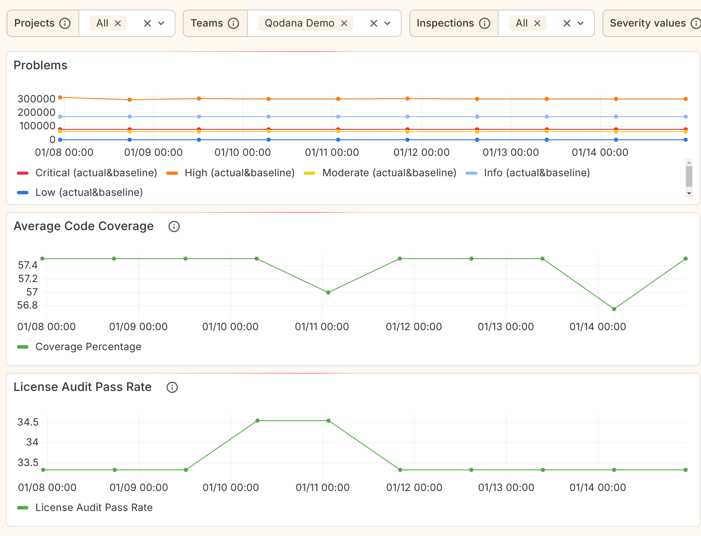

# Grafana Dashboard Template

### Prerequisites

1. Grafana
2. Grafana Infinity Plugin
3. Access to the [Qodana Public API](https://www.jetbrains.com/help/qodana/cloud-api.html)

### Setup

1. Follow the [official documentation](https://grafana.com/docs/grafana/latest/datasources/) for how to add a new data
   source
    1. Use `Infinity` as data source type
    2. Add the [Qodana Public API token](https://www.jetbrains.com/help/qodana/cloud-organizations.html#cloud-organizations-api-token) as bearer token
    3. Add `https://qodana.cloud` as base URL (or the base URL of your self-hosted Qodana instance)
2. Import a new dashboard from the provided [qodana.grafana.json](qodana.grafana.json) file
3. Select the data source you created in the previous step
4. Done! All variables will populate automatically based on the auth token you provided

